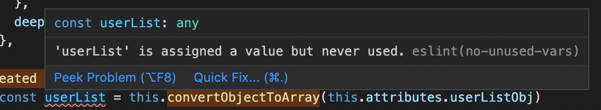

Today as I am refactoring a Vue codebase, I come across something like this:

```javascript
// userListObj and countryListObj are props

const userList = []
Object.entries(this.attributes.userListObj || {}).forEach(([key, value]) => userList.push({
  label: value,
  value: key,
}))

const countryList = []
Object.entries(this.attributes.countryListObj || {}).forEach(([key, value]) => countryList.push({
  label: value,
  value: key,
}))

// ... 10+ more similar conversions

```

The goal here is to convert all the objects to arrays. We can simplify it by creating a function to do this. It can reduce a good chunk of line of codes. Initially I try to do this.

```javascript
// Method 1 - Pass array into the function

convertObjectToArray(obj, arr) {
  Object.entries(obj).forEach(([key, value]) => arr.push({
    label: value,
    value: key,
  }))
}

// ... use it like this
const userList = []
this.convertObjectToArray(this.attributes.userListObj, userList)
```

It works, but later on I feel that it's easier to read if I return a new array instead of passing an array into the `convertObjectToArray` method. So I do this.

```javascript
// Method 2 - Return new array

convertObjectToArray(obj = {}) {
  const arr = []
  Object.entries(obj).forEach(([key, value]) => arr.push({
    label: value,
    value: key,
  }))
  return arr
}

// ... use it like this
const userList = this.convertObjectToArray(this.attributes.userListObj)
```

First, we turn 2 lines of code into 1. It is also cleaner because it always return a new array. Imagine we accidentally call the method twice on the same array, we will get double-sized output.

The last thing is that ESLint support (`no-unused-vars`). If we use method 1, ESLint would not show any error as it thinks we are using the variable when we pass the array into the function.

But if we are using method 2, ESLint will show error if there is any unused variable, like so



And indeed, there are unused/redundant code which I can safely remove to clean up the codebase.

## End Note

You probably heard about functional programming and the reasons of using it. Perhaps this will make you want to use functional programming even more. You do not have to refactor the entire codebase into a functional oriented codebase, it's more about writing code that is easier to reason about.

Up until next time!