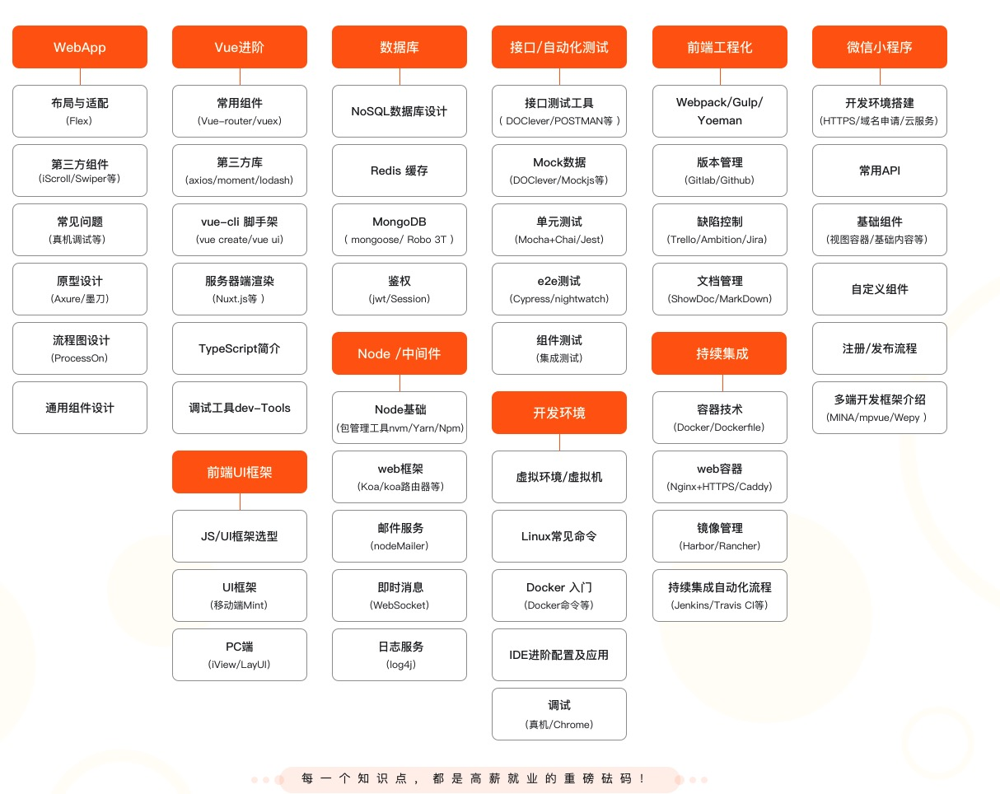

 on [Unplash](https://unsplash.com/photos/WE_Kv_ZB1l0)")

***Note: The following post only shares websites that are in Chinese. If you want to know those in English, feel free to drop me a message, I am more than happy to share some with you!***

My new employer provides us a learning budget every year. I was looking for a good learning websites to put the budget into good use. Here are some that my colleagues share with me, and now I am here to share it with you.

### 1. Geekbang

https://time.geekbang.org/

***If you want to learn specific topics from professionals in the industry, look no further***

Want to learn from ex-Googler, ex-Alibaba architect or the like? Well you're in luck. The lessons are usually instructed by actual professionals in the industry. 

The courses are usually in audio and text (both together). You can learn by just listening to the audio if you want, but usually the instructor would share images or code in the text, so it may be better to listen and read the text at the same time.

If you are not sure whether it is suitable for you, you get to watch any 4 free lessons for free, each course!

Personally I have enrolled in the ["Learn Software Achitecture From Zero"](https://time.geekbang.org/column/intro/100006601) and I love it. The instructor dives deep into the topic and there are 60 lessons. You can also see him replying students' comments as well.

I also listened to ["Relearn Frontend"](https://time.geekbang.org/column/intro/100023201). Within that 4 lessons, I already learned something new that I had never heard before, like `Symbol`, `getOwnPropertyDescriptor` and so on. I admit I am not the smartest frontend engineer out there!

If you want to take your knowledge to the next level, be sure to check Geekbang out.

### 2. IMOOC

https://www.imooc.com/

***Disclaimer: I have never enrolled any course on this site before, but there is a course that makes me want to share it.***

First, let's us take a look at the a screenshoot from this [link](https://class.imooc.com/sale/webfullstack?mc_marking=1eb5ce0be2ada8da4a6387b391f00b92&mc_channel=syzcjj1).

Frontend, backend, testing, deployment, it got it all. It also covers mini program as well. It covers topics like Redis and logging which are something you don't usually see. The course covers a lot of different topics and it is always a nice thing to see. 

This course(not this website overall) is the opposite of what we see on Geekbang. This course covers a lot, but it doesn't dive deep into it, it's more like knowing how everything works together.

It definitely looks interesting, if you are the student of the course, I want to know more from you!

### 3. Bilibili

https://www.bilibili.com/

***Youtube, but with more***

No, we are not here to binge watching some videos here like we binge watching Youtube. We are here for the good stuff.

*Want to learn about Golang? No problem.*

*Vue 3 is out, where can I learn? Welcome my boy.*

*Looking for videos on algorithm? Here they are*

Basically, Chinese Youtube on steroid. Currently I am learning ["Algorithm: LeetCode Practice"](https://www.bilibili.com/video/BV1GW411Q77S?from=search&seid=18292995973430982029) and ["Golang Study Guide: Learn Golang in 21 Weeks"](https://www.bilibili.com/video/BV16E411H7og?from=search&seid=14089227711144343796)

I have heard of Bilibili for a long time from a friend, but I thought it is entertainment only kind of website. I am happy to learn that I am wrong!

## End Note

That's it! These are the sites that I heard about from my colleagues. Where do you usually learn? Do you have a preference? Be sure to drop a message!

